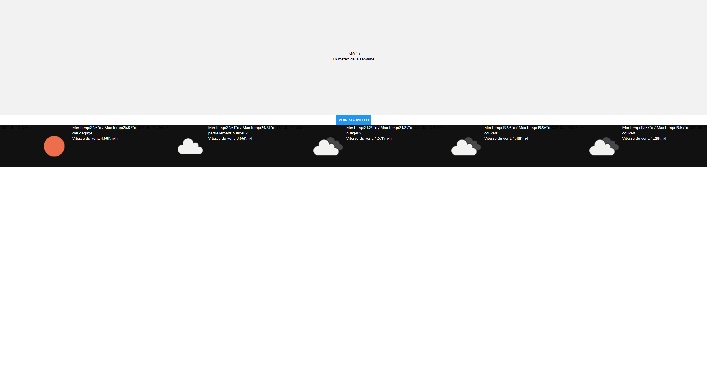

# METEO-APP-TEST

[1]#Librairies & Frameworks utilisés

Projet sous REACT 17.0.1 ==> https://github.com/facebook/react/blob/main/CHANGELOG.md#1702-march-22-2021
REACT-NATIVE ==> https://reactnative.dev/docs/0.64/getting-started
EXPO 44.0.0 ==> https://docs.expo.dev
OPENWEATHERMAP API ==> https://openweathermap.org/api

[2]#But et fonctionnement de l'app

L'idée est simple et standard il s'agit d'une application REACT-NATIVE utilisant l'API OpenWeatherMAP pour émuler une page standard de météo France

[3]#Exemple cible!

